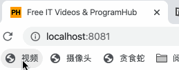
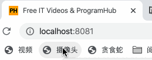
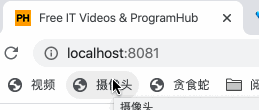
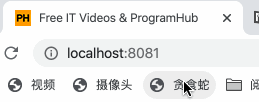

# Favicon - 在浏览器 Favicon 中创造交互式内容

[](https://github.com/a552422934/Favicon) [](LICENSE)

**Favicon** 是一个有趣的 JavaScript 库，允许你在浏览器的 favicon（网站图标）中创建动态交互式内容。它可以将视频播放、摄像头监控、小游戏等嵌入到小小的 favicon 中，为用户提供一种独特的"摸鱼"体验。

## ✨ 特性亮点

- 🎥 **视频播放**：在 favicon 中播放视频，支持键盘控制进度和音量
- 📹 **摄像头监控**：实时显示摄像头画面，支持怀旧滤镜
- 🐍 **贪食蛇游戏**：在 favicon 中玩贪食蛇，记录最高分
- 🎨 **多种滤镜**：支持灰色、反色、黑白、怀旧等多种滤镜效果
- ⌨️ **键盘控制**：使用方向键控制视频播放和游戏操作
- 📱 **纯前端实现**：无需后端，基于 HTML5 Canvas 和 WebRTC

## 🚀 快速开始

### 方式一：CDN 引入
```html
<script src="https://cdn.jsdelivr.net/gh/a552422934/Favicon@0.1/icon.js"></script>
```

### 方式二：本地引入
1. 下载 [icon.js](icon.js) 文件
2. 在你的 HTML 文件中引入：
```html
<script src="path/to/icon.js"></script>
```

### 方式三：直接使用演示页面
打开 [index.html](index.html) 即可体验全部功能。

## 📖 使用指南

### 视频播放模式
```javascript
// 设置模式为视频
window.ictype = 'video';
// 加载库
// （通常通过 script 标签加载 icon.js）
// 注意：加载后会弹出输入框让用户输入视频地址，留空则使用默认视频
```

**键盘控制**：
- **← / →**：快退/快进 5 秒
- **↑ / ↓**：增加/减少音量 0.1



### 摄像头模式
```javascript
window.ictype = 'camera';
// 加载库
```

摄像头会自动开启并显示怀旧滤镜效果，可以用于监控身后情况。




### 贪食蛇游戏模式
```javascript
window.ictype = 'snake';
// 加载库
```

**游戏规则**：

- 使用方向键控制蛇的移动
- 吃到食物增加分数
- 撞到边界或自己游戏结束
- 最高分保存在 localStorage 中



## 🔧 详细配置

### 全局配置变量
| 变量名 | 类型 | 默认值 | 说明 |
|--------|------|--------|------|
| `window.ictype` | string | - | 必需：`'video'`、`'camera'` 或 `'snake'` |
| `window.vurl` | string | - | 已废弃：视频模式现在通过弹出框输入视频地址 |

### API 参考

#### Icon 类
```javascript
const icon = new Icon();

// 初始化视频播放器
icon.initVideo(url); // url: 视频URL，可选

// 初始化摄像头
icon.initCam(); // 异步方法，返回 Promise

// 应用滤镜（怀旧滤镜）
icon.videoToImageByFilter();
```

#### Snake 类
```javascript
const snake = new Snake();

// 初始化游戏
snake.init();

// 手动移动（通常由定时器自动调用）
snake.move();

// 设置食物
snake.setFood();
```

### 自定义滤镜
Favicon 内置了多种滤镜算法，你可以在代码中切换使用：

```javascript
// 灰色滤镜（取消注释即可使用）
// var avg = (r + g + b) / 3;
// imgdata.data[i] = imgdata.data[i+1] = imgdata.data[i+2] = avg;

// 反色滤镜（底片效果）
// imgdata.data[i] = 255 - r;
// imgdata.data[i+1] = 255 - g;
// imgdata.data[i+2] = 255 - b;

// 黑白滤镜
// imgdata.data[i] = avg > 128 ? 255 : 0;
// imgdata.data[i+1] = avg > 128 ? 255 : 0;
// imgdata.data[i+2] = avg > 128 ? 255 : 0;

// 怀旧滤镜（当前默认）
var newR = (0.393 * r + 0.769 * g + 0.189 * b);
var newG = (0.349 * r + 0.686 * g + 0.168 * b);
var newB = (0.272 * r + 0.534 * g + 0.131 * b);
```

## 🎯 高级用法

### 扩展新功能
由于 favicon 尺寸为 32×32 像素，你可以在 30×30 的可用空间内（边框1px）创建更多小游戏：

- 俄罗斯方块
- 魔塔
- 坦克大战
- 推箱子

### 多标签页应用
```html
<!-- 1号标签页：看视频 -->
<a href="javascript:window.ictype='video';loadFavicon();">视频</a>

<!-- 2号标签页：开摄像头 -->
<a href="javascript:window.ictype='camera';loadFavicon();">摄像头</a>

<!-- 3号标签页：玩贪食蛇 -->
<a href="javascript:window.ictype='snake';loadFavicon();">贪食蛇</a>
```

## 📁 项目结构

```
iconjs/
├── icon.js              # 主库文件
├── index.html           # 演示页面
├── README.md           # 本文件
├── demo.md             # 详细开发文档
├── lol.mp4             # 默认视频文件
├── img/                # 演示动图
│   ├── 01-video.gif
│   ├── 02-cam.gif
│   ├── 02-cam-filter.gif
│   ├── 02-cam-filter2.gif
│   └── 03-snake.gif
└── .gitignore          # Git 忽略文件
```

## 🤝 贡献指南

欢迎贡献代码、报告问题或提出建议！

1. Fork 本仓库
2. 创建功能分支 (`git checkout -b feature/amazing-feature`)
3. 提交更改 (`git commit -m 'Add some amazing feature'`)
4. 推送到分支 (`git push origin feature/amazing-feature`)
5. 开启 Pull Request

### 开发注意事项
- 保持代码简洁，使用中文注释
- 确保所有功能在主流浏览器中正常工作
- 添加新功能时更新 demo.md 和 README.md
- 遵循现有的代码风格

## 📄 许可证

本项目基于 MIT 许可证开源 - 查看 [LICENSE](LICENSE) 文件了解详情。

## 🙏 致谢

- 灵感来源：[Animating URLs with Javascript and Emojis](https://matthewrayfield.com/articles/animating-urls-with-javascript-and-emojis/)
- 感谢所有贡献者和使用者

## 📞 联系方式

- GitHub: [@a552422934](https://github.com/a552422934)
- 项目地址: [https://github.com/a552422934/Favicon](https://github.com/a552422934/Favicon)

---

**温馨提示**：本工具旨在提供有趣的开发体验，请在合理合法的范围内使用。摸鱼虽好，可不要耽误正事哦~ 😉

<p align="center">
  <sub>Made with ❤️ by a552422934</sub>
</p>
